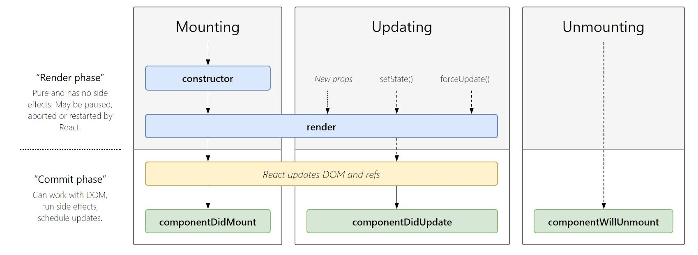

# React-Concepts

- Repo to share my understanding and note of React 🌻
  <!-- Try to make it simple & only contain essential message -->
  <!-- Focus on simple comparison tables & conclusions only (not too much description)  -->

---

## React vs Angular vs Vue

|                         |         :bulb: React :bulb:         |     :cactus: Angular :cactus:     |        :fire: Vue :fire:        |
| :---------------------: | :---------------------------------: | :-------------------------------: | :-----------------------------: |
|    **Released Year**    |                2013                 | 2010 AngularJS</br>2016 Angular2  |              2014               |
|    **Maintained by**    |              Facebook               |              Google               |        Independent team         |
|    **Official Site**    | [Reactjs.org](https://reactjs.org/) | [Angular.io](https://angular.io/) | [Vuejs.org](https://vuejs.org/) |
| **Package Type - Size** |           Library - 100KB           |         Framework - 500KB         |        Framework - 80KB         |
| **Preferred Languages** |           JavaScript, JSX           |            TypeScript             |                                 |
|  **Biggest Strength**   |             Flexibility             |         Complete package          |           Simplicity            |
|   **Latest Version**    |         2018.11 React 16.X          |         2020.02 Angular 9         |         2019.02 Vue 2.6         |

---

## Function vs Class Components (& When to use them)

- **Class components** are ES6 classes.

- **Function components** are components that only contain a render method and don’t have their own state. They take props as input and return only what should be rendered.

|                                     | :bulb: Function Components :bulb:                                                                                                                                      | :cactus: Class Components :cactus:                      |
| :---------------------------------- | :--------------------------------------------------------------------------------------------------------------------------------------------------------------------- | :------------------------------------------------------ |
| Alias                               | 'Dumb' or 'stateless' components (only props, no state)                                                                                                                | 'Smart' or 'stateful' components (both props and state) |
| Main purpose                        | Presentational component to render UI                                                                                                                                  | Dynamic component to implement logic and state          |
| Can accept and use props            | Yes                                                                                                                                                                    | Yes                                                     |
| Has its own local state?            | No </br>(but can use React Hooks to manage state)                                                                                                                      | Yes                                                     |
| Lifecycle methods                   | N/A </br> (but can use React Hooks to achieve same effects)                                                                                                            | Yes                                                     |
| render() method                     | No need                                                                                                                                                                | Required                                                |
| React Hooks </br> (from React 16.8) | Yes                                                                                                                                                                    | N/A                                                     |
| Benefits                            | 1. Easier to read & write (less code) </br> 2. Easier to test & debug (because they are plain JavaScript functions)</br> 3. Likely a performance boost in future </br> |

**Conclusion**: Functional components are preferable and should be used wherever possible (especially after the introduction of React Hooks from React 16.8). Only convert function components to class components when needed.

<i>(Refer to <u>src/ComponentTypes.js</u>: Examples of Function & Class components)</i>

---

## Props vs States

**1. Passed to components vs Initialised within components:**

- Props are a component's configuration that can be passed from parent to child component (similar to function parameters).
- States are directly initialised and managed within the component (similar to variables declared within a function). State is private and fully controlled by the component, and it cannot be accessed/modified outside the component.

**2. Static data vs dynamic data:**

- If you are building a static version of app, use props all the time and don’t use state.
- State is reserved only for interactivity (i.e. data that changes over time).

|                                                       | :bulb: Props :bulb: | :cactus: States :cactus: |
| :---------------------------------------------------: | :-----------------: | :----------------------: |
|                        Source                         |      external       |         internal         |
|               plain JavaScript objects                |         Yes         |           Yes            |
| hold information that influences the output of render |         Yes         |           Yes            |
|     Can get initial value from parent Component?      |         Yes         |           Yes            |
|          Can be changed by parent Component?          |         Yes         |            No            |
|       Can set default values inside Component?        |         Yes         |           Yes            |
|             Can change inside Component?              |         No          |           Yes            |
|      Can set initial value for child Components?      |         Yes         |           Yes            |
|            Can change in child Components?            |         Yes         |            No            |

**Conclusion**: If a component needs to alter one of its attributes at some point in time, then that attribute should be part of its state. Otherwise, it should just be a prop for that component.

---

## Lifecycle methods vs React Hooks



Source: [React Lifecycle Methods Diagram](http://projects.wojtekmaj.pl/react-lifecycle-methods-diagram/)

- **Lifecycle methods**: componentDidMount, componentDidUpdate and componentWillUnmount (Other lifecycle methods will be deprecated in React 17).

- **React Hooks**: useEffect, useState etc.

| :bulb: Class - Lifecycle Methods :bulb: | :cactus: Function - React Hooks</br>(from React 16.8) :cactus: |
| :-------------------------------------: | :------------------------------------------------------------: |
|            componentDidMount            |                     useEffect(()=>{}, [])                      |
|           componentDidUpdate            |                       useEffect(()=>{})                        |
|          componentWillUnmount           |            useEffect(() => {return () => {} }, [])             |
|              Constructor()              |                           useState()                           |
|                  state                  |                           useState()                           |

- **Benefits of using React Hooks**

  **1. Less code**: In class components, any setup in 'componentDidMount' would have 'componentWillUnmount' in order to clean up. When using Hooks, there is no need to do this since the mounting and unmounting logic is enclosed inside the same function scope.

  **2. Better future React performance optimisations**

<i>(Refer to <u>src/LifecycleToHooks folder</u>: for code snippets & explanation)</i>

---

## How to convert from Function to Class Components

1. Create an ES6 class, with the same name, that extends React.Component.
2. Add a single empty method to it called render().
3. Move the body of the function into the render() method.
4. Replace props with this.props in the render() body.
5. Delete the remaining empty function declaration.

<i>(Refer to <u>src/ClassToFunction.js</u>: How to convert from class to function component)</i>

---

<!-- --- -->

## Future Topics

#### Controlled vs Uncontrolled Elements

#### Why we don't mutate states (directly) in React

#### Why do we need to lift the state & How to do it

<!-- - Class components, State Management, Passing Props (from parent to child)

0. Passing props

- When React sees an element representing a user-defined component, it passes JSX attributes and children to this component as a single object. We call this object “props”.

```javascript
const App = () => {
  return <Playground name="Mickey Mouse" />;
};
```

```javascript
const Playground = (props) => {
  console.log(props); // {name: "Mickey Mouse"}
  return <h1>The Playground of {props.name}!</h1>;
};
```

1. [child] Value is saved in 'state' of child component

```javascript
// State: In React, components use state to 'remember' things.

class Square extends React.Component {
  constructor(props) {
    super(props);
    this.state = {
      value: null,
    };
  }
```

2. [child] create an event handler (e.g. onClick) & use setState to store the change of value in 'state' of child component

```javascript
class Square extends React.Component {
    // ...
render() {
    return (
      <button
        onClick={() => this.setState({value: 'X'})}
      >
        {this.state.value}
      </button>
    );
  }
```

3. [child -> parent] Lift value from 'state' of child component up to 'props/ this.state' in parent component
4. [parent -> child] pass 'props' from 'parent' component to 'child' component (now the value is saved in props in the 'parent')

```javascript
// Passing props: how information flows in React apps, from parents to children. The parent component can pass the state back down to the children by using props.

class Board extends React.Component {
  constructor(props) {
    super(props);
    this.state = {
      squares: Array(9).fill(null),
    };
  }

  renderSquare(i) {
    return <Square value={this.state.squares[i]} />;
  }
  // ...
```

```javascript
class Square extends React.Component {
//...
      <button >
        {this.props.value}
      </button>
```

5. [parent] Create an event handler 'onClick={() => this.handleClick(i)}' (also create handleClick(i) function)

```javascript
class Board extends React.Component {
    // ...
  handleClick(i) {
    const squares = this.state.squares.slice();
    squares[i] = 'X';
    this.setState({squares: squares});
  }

  renderSquare(i) {
    return (
      <Square
        value={this.state.squares[i]}
        onClick={() => this.handleClick(i)}
      />
      // In React, it’s conventional to use on[Event] names for props which represent events and handle[Event] for the methods which handle the events.
```

6. [parent -> child]: pass 'props/ onClick()' to 'child' component 'onClick={() => this.props.onClick()' (child components are now controlled components. The parent has full control over them.)

```javascript
class Square extends React.Component {
  render() {
    return (
      <button className="square" onClick={() => this.props.onClick()}>
        {this.props.value}
      </button>
    );
  }
}
``` -->

---

## References

- [Official React Documentation](https://reactjs.org/)
- [React Guide](https://github.com/uberVU/react-guide/blob/master/props-vs-state.md)
- [React Lifecycle Methods Diagram](http://projects.wojtekmaj.pl/react-lifecycle-methods-diagram/)
- [Replacing Component Lifecycle Methods with React Hooks](https://blog.carbonfive.com/2019/10/15/replacing-component-lifecycle-methods-with-react-hooks/)

©2020 Ellie Chen - All Rights Reserved.
